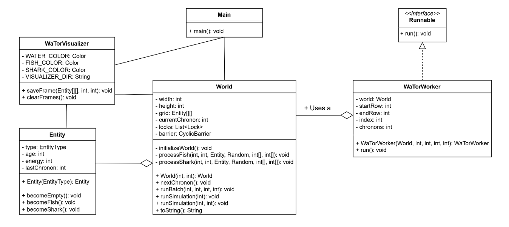
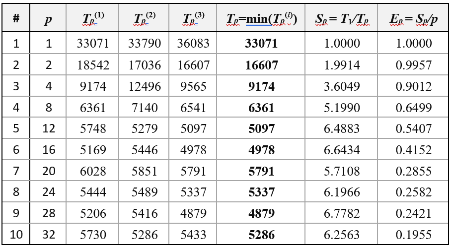
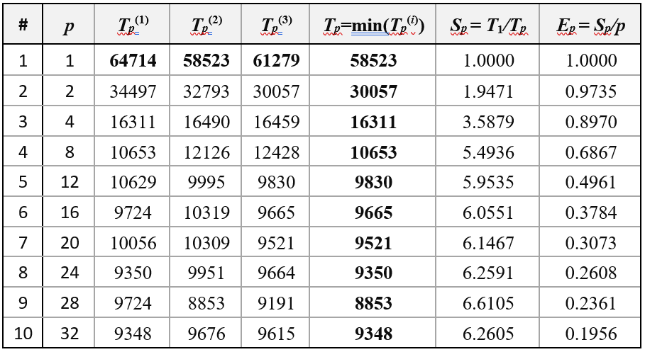
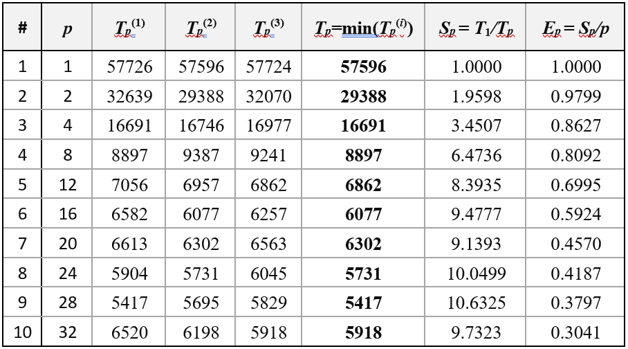
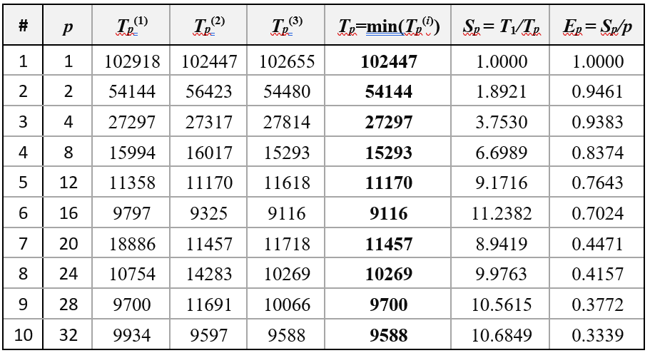
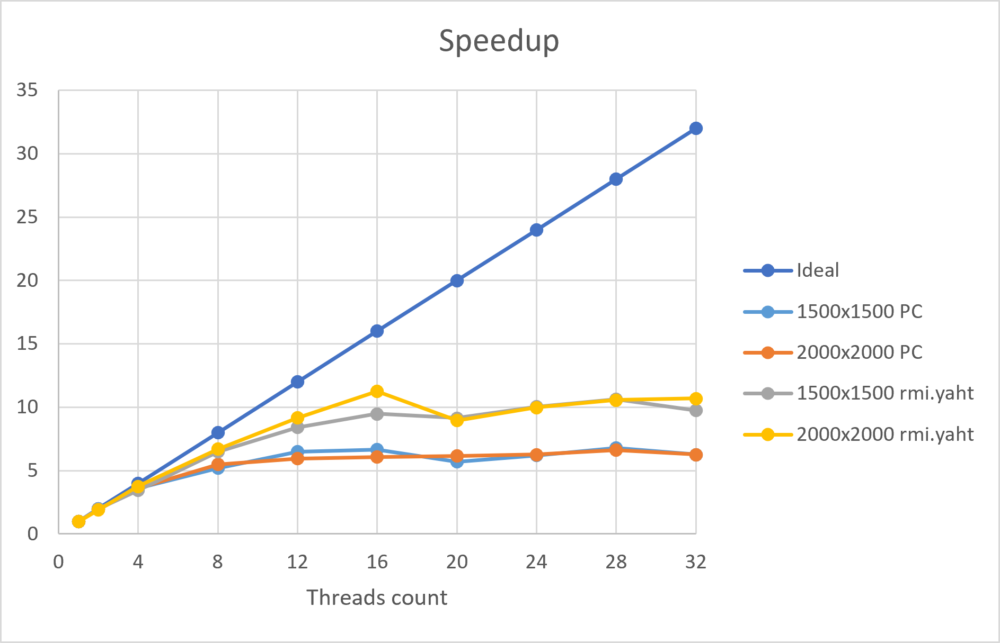
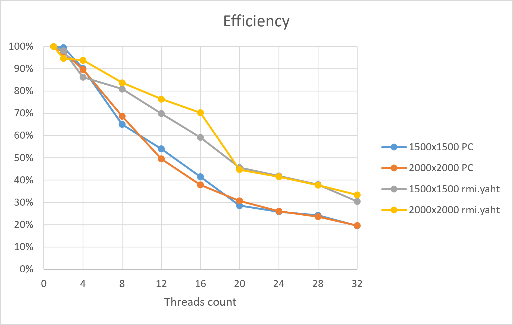
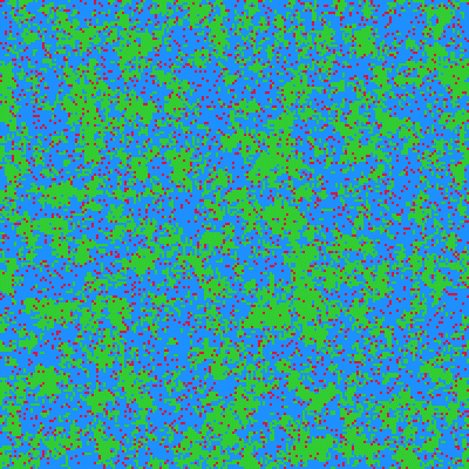

# Parallel Implementation of the Wa-Tor Simulation

This project is a high-performance parallel implementation of the **Wa-Tor** (Water-Torus) cellular automaton, a predator-prey model originally introduced by Alexander Dewdney. It is developed in **Java** and optimized for multi-core systems using shared memory.

## Simulation Overview
The Wa-Tor world is a discrete grid shaped like a **torus**, where the last row/column wraps around to the first. The simulation proceeds in discrete time steps called **chronons**.
*   **Fish:** Move to adjacent empty cells and reproduce at a specific age, leaving an offspring at their previous position.
*   **Sharks:** Hunt fish for energy. If no fish are found, they move to empty cells. Sharks lose energy every chronon and die if it reaches zero. They also reproduce upon reaching a specific age.

## Parallel Architecture
The implementation follows a **local-synchronous model** to maximize performance on multi-core processors.
*   **Data Decomposition:** The matrix is divided into horizontal strips (rows). Each worker thread processes exactly one strip, ensuring **coarse granularity**.
*   **Static Balancing:** Tasks are distributed fixedly at startup, which is optimal for the relatively homogeneous load of the Wa-Tor world.
*   **Synchronization:** 
    *   **CyclicBarrier:** Ensures all threads complete the current chronon before any proceed to the next.
    *   **ReentrantLocks (Mutexes):** Protect shared memory at the boundaries of the strips (specifically the first and last two rows of each strip) to prevent race conditions during entity movement.

## System Design
The project structure and logic are defined by the following class diagram. It shows the relationships between `Main`, `World`, `WaTorWorker`, `Entity`, and `WaTorVisualizer`.



## Performance Results
The algorithm was benchmarked on two different hardware environments to measure scalability:

1.  **Home Desktop:** AMD Ryzen 7 3700X (**8 Cores / 16 Threads**).
2.  **FMI Server:** Intel Xeon E5-2660 (**16 Cores / 32 Threads**).

### Testing Scenarios
All tests were conducted using the following parameters:
*   **Duration:** 500 chronons.
*   **Grid Sizes:** 1500 x 1500 and 2000 x 2000 matrix.
*   **Initial Population:** 30% fish and 10% sharks.

### Performance Metrics Legend
The following parameters are used in the results tables:

| Parameter | Description |
| :--- | :--- |
| **$p$** | Number of threads used in the simulation |
| **$T_p$** | Minimum execution time (ms) from three consecutive test runs |
| **$S_p$** | **Speedup**: $T_1 / T_p$ (how many times faster the parallel version is) |
| **$E_p$** | **Efficiency**: $S_p / p$ (utilization of the available cores) |

### Benchmarking Data
The following tables represent the data collected during the 500-chronon simulation runs:

#### Table 1: Home Desktop (8 cores) | 1500x1500


#### Table 2: Home Desktop (8 cores) | 2000x2000


#### Table 3: FMI Server (16 cores) | 1500x1500


#### Table 4: FMI Server (16 cores) | 2000x2000


### Scalability Analysis
The results confirm that the **local-synchronous model** is highly effective. While the home computer reaches its physical core limit quickly, the server scales effectively up to 16 threads, proving that architectural scalability is more vital than single-core speed for this simulation.

#### Speedup and Efficiency





## Getting Started

### Compilation
Compile the source files using the standard Java compiler:
```bash
javac *.java
```

### Running the Application
Launch the simulation and enter the requested parameters (grid size, chronons, threads) in the terminal:
```bash
java Main
```

### Performance Benchmarking
To replicate the results in the report, use these standard scenarios:
*   **Small:** 1500x1500x500 chronons.
*   **Large:** 2000x2000x1000 chronons.

## Visualization and GIF Generation
If enabled, the program saves the world state every 10 chronons as `.png` files in the `frames/` directory.
*   **Water:** Light Blue
*   **Fish:** Green
*   **Shark:** Red
*   **Cell Size:** 4x4 pixels.

#### 200x200 visualization:


#### 500x500 visualization:


#### 1500x1500 visualization:


To generate an **animated GIF** (10 FPS) from the exported frames using **FFmpeg**, run:
```bash
ffmpeg -framerate 10 -i "frames\frame_%04d.png" -c:v gif example_name.gif
```